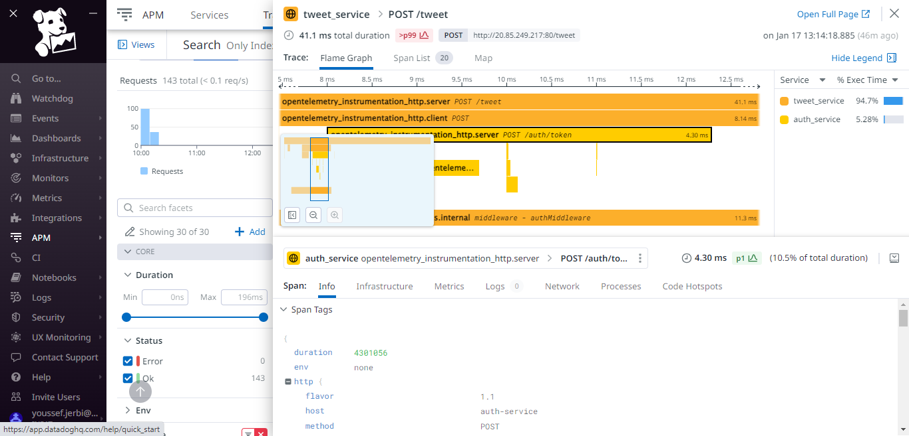

# Introduction
This is an academic project that consists of implementing an infrastructure using DevOps tools that encapsulates three different concepts:

1. Deployment
2. Automation
3. Observability

# Microservices
The application is a Twitter clone API, made with Express, that allows to send tweets and retweet an existing tweet.
The application is composed of 2 microservices: An authentication service and a tweet service, each interrogating and storing data inside a PostgreSQL database.

# Deployment
## Infrastructure
Each service infrastructure is composed of Service that allows communication inside the cluster with each a deployment that controls the lifecycle of the pods. To configure each service, we pass parameters as environment variables such as the ports, service names and observability endpoints for
Tracing and Logging.
I packaged the application in a Helm Chart and deployed it in a remote repository.

You can find more information about the helm chart [here](./chart/).

## Deployment Strategy
Currently, I have not implemented a deployment strategy due to time constraints. However, there is an idea in mind. As this is a Twitter API, you can add more features and try to test it to specifc set of communities and see how it works out. That's why I thought of A/B testing while adding a functionality of liking a tweet and study the user feedback and system performance. 

# Automation
To automate the deployment of the application inside an Azure Kubernetes Cluster, I chose to use Terraform to install resources in the cluster and manage the interconnected systems within it. I decided to create stacks for the steps needed to run the application with its internal and external functionalities. The stacks are as follows:
1. Azure Kubernetes Cluster Provisioning
2. Database Initialization
3. Application Deployment (microservices and ingress controller)
4. Observability tools Deployment

More informations can be found about the stacks [here](./terraform/)

For changes in code I applied a CI workflow using Github Actions that builds the Docker Images through each service's Dockerfile and push these images to the Docker Hub where in turn they will be used by the Helm Chart.

# Observability
In this part, we test how our systems works by observing what the services expose such as metrics, logs and traces.

## 1 - Metrics
I used Prometheus to collect metrics from Node JS apps with the use of Prometheus Client that helps you to get metrics from the endpoint `/metrics` then we can use Grafana to visualize the metrics stream in real-time a time series database.

The metrics defined in this project are:

- Auth Service
  - `auth_service_counter` : The number of HTTP requests that enters the service(by `path` or `method` or `ip`).
  - `auth_service_register_success_counter` : Number of successful register requests (by `ip`).
  - `auth_service_register_total_counter` : Number of total register requests.
  - `auth_service_login_success_counter`: Number of successful login requests (by `ip`)
  - `auth_service_login_total_counter`: Number of total login requests
  - `auth_service_token_total_counter` : Number of total token validation requests
  - `auth_service_token_success_counter` : Number of succesful token validation requests

- Tweet Service
  - `tweet_service_counter` : Number of HTTP requests made to this service (by `path` or `method`)
  - `tweet_service_retweet_counter` : Number of Retweets (by `tweet_id`)
  - `tweet_service_tweet_counter` : Number of Tweets posted (by `user_id`)
  - `tweet_service_tweet_histogram` : Histogram to track tweets created (by `user_id`)

### Business Logic Metric
In the case of Twitter it is highly effective to see the Tweet posting rate for each user. That way we can get an overview vision about user consumption and how they use the platform.

## 2 - Logs
I implemented a logging functionality using Winston which is a Library for NodeJS that is widely used for creating structured logs in different formats(such as file, console or even sending logs through HTTP).

For log collection, DataDog was the primary choice as it allowed an intuitive User Interface and setting the agent was fairly simple as it was packaged in a Helm Chart with basic configuration.

## 3 - Traces
By far the most challenging task, it required setting up a tracing process and an Exported inside our NodeJS applications. At first, I opted to use Jaeger for tracing collection and although it was able to do so locally, I was unable to deploy it to the cluster and access the traces data from there. 

By Consequence, I opted for DataDog as it was natively adapted for such task and the agent was aleady deployed for log collection. It just required an additional configuration and I was good to go.

The traces are auto-instrumented so I did not apply any custom traces by processing the requests and creating spans for the handlers. This can be configured in the tracer code inside the application services.

# Contibuting
This project is part of an academic course. Any Pull Requests are welcome.

# License
This project is licensed under the MIT license.