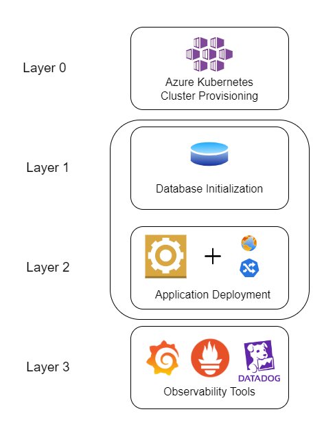

# Terraform Provisioning

To automate the process of building the infrastructure, I opted to use Terraform which is a well-renowned provisioning tool that allows us to create resources through API called providers.

# Microstacks

The infrastructure is composed of 4 microstacks which is how every component of the project is initiated.

## 1 - Azure Provisioning
In this microstack we initialize the Kubernetes Cluster creation while saving the current state in a remote backend (in a Azure Storage Account container)
## 2 - Database Initialization
This is where we deploy Kubernetes Resources to the cluster, where we get the configuration by calling the remote state of the first microstack.
## 3 - Application Deployment + Ingress Controller
The logic is to independently deploy the application (without database connection, of course) on a Kubernetes cluster, then exposing the app and its endpoints to a public address by adding a Load Balancer Nginx Ingress Controller with rules that redirects to each service (Authententication and Tweets services)
## 4 - Observability
This is an additional functionality to our infrastructure. It is composed of agents and operators that allows us to track informations going in and out of our application. I chose to deplot DataDog Agent for Traces and Logs, Prometheus for metrics generation, and Grafana for Visualization.

